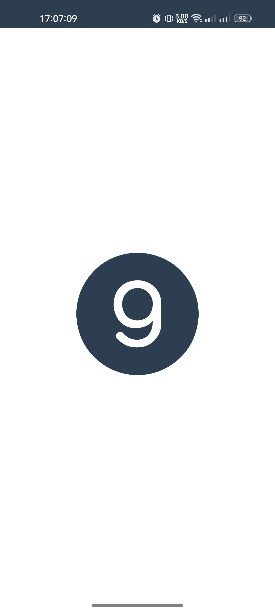
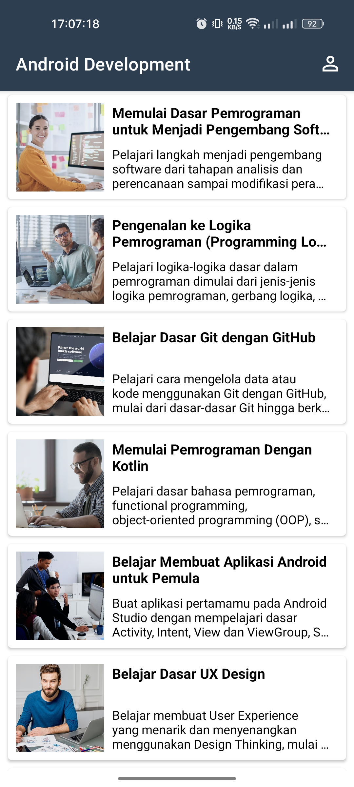
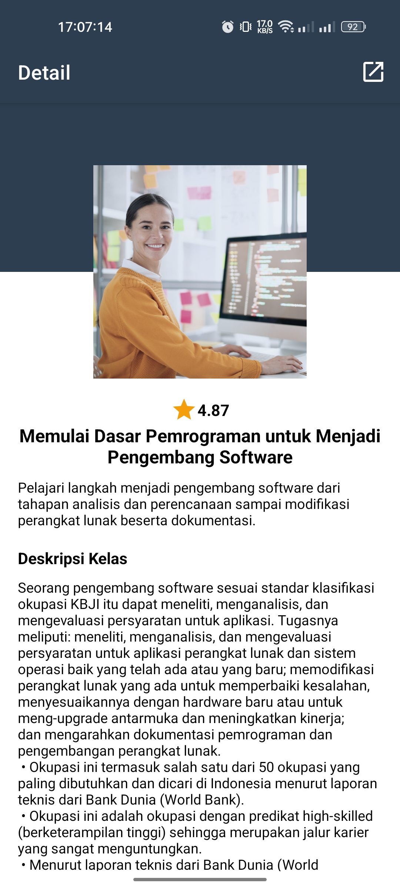
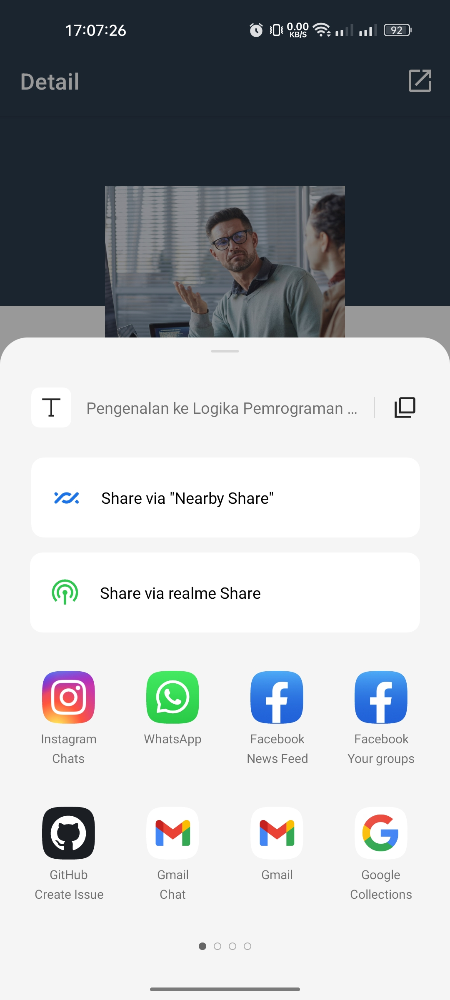
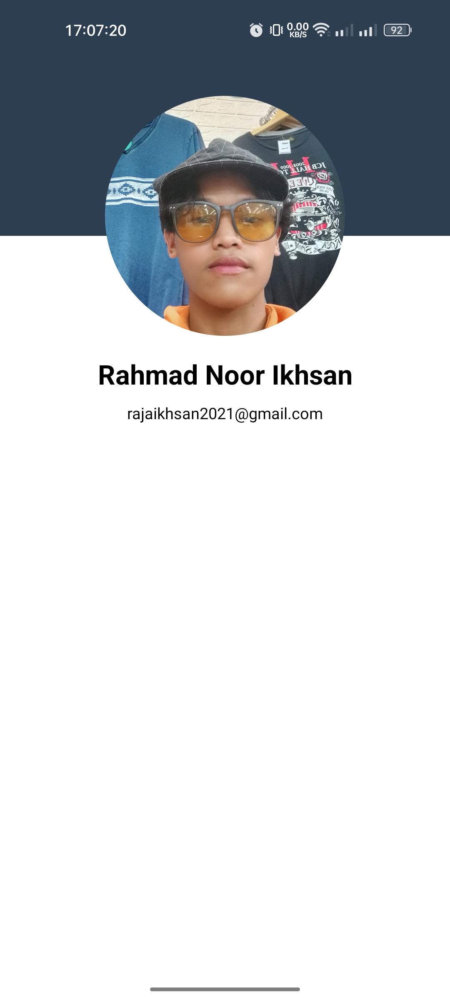

# AndroidDevelopment
Submission Belajar Membuat Aplikasi Android untuk Pemula Dicoding Academy in Bangkit Academy Mobile Development 2023

> **Warning**
> USE THIS PROJECT AS A REFERENCE FOR YOUR SUBMISSION. DO NOT SEND OR COPY PASTE THIS PROJECT FOR YOUR SUBMISSION!

## Submission Screenshots: 
<table>
    <tr>
        <td>
        <td>
        <td>
    </tr>
    <tr>
        <td>
        <td>
        <td>
    </tr>
<table>
